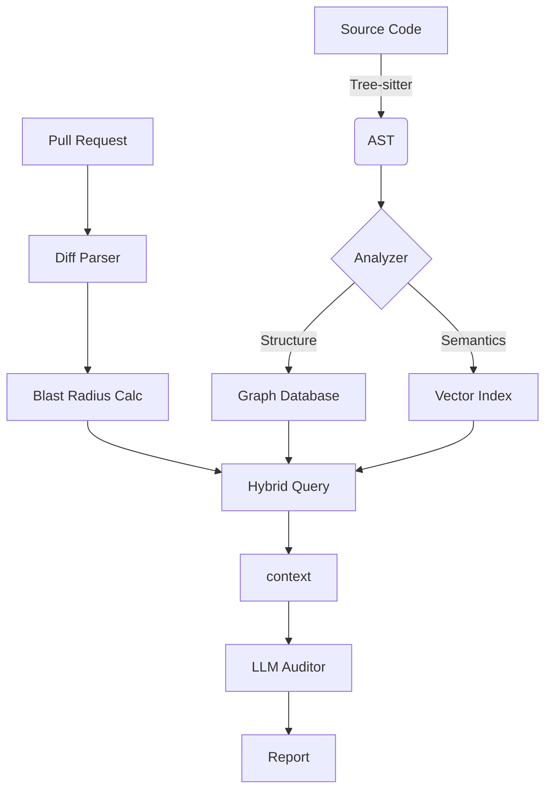

# Architecture

CodeGraft employs a dual-phase analysis strategy that combines deterministic symbolic analysis with semantic reasoning. This approach aims to eliminate the nondeterminism often associated with LLM-based code review tools by grounding all observations in a verified "Structural Skeleton" (the Dependency Graph).

## System Overview

The system operates on two primary data structures:
1.  **Dependency Graph (Structural)**: Directed graph representing strict code relationships (imports, inheritance, function calls).
2.  **Vector Index (Semantic)**: High-dimensional embeddings of code snippets for semantic similarity search.

This **GraphRAG** (Graph-Retrieval Augmented Generation) architecture ensures that semantic queries ("Find authentication logic") are validated against structural facts ("Is this module reachable from the public API?").

## Core Components

### 1. Ingestion Engine (Tree-sitter)
We use [Tree-sitter](https://tree-sitter.github.io/tree-sitter/) for robust, error-tolerant parsing. It processes source code into an Abstract Syntax Tree (AST), extracting:
*   **Symbols**: Classes, functions, variables.
*   **Relationships**: `CALLS`, `IMPLEMENTS`, `EXTENDS`.
*   **Scopes**: Identifying variable shadowing and visibility.

### 2. Storage Layer (SurrealDB)
CodeGraft uses [SurrealDB](https://surrealdb.com/) as a multi-model database to store both graph nodes and vector embeddings in a single persistence layer. This reduces complexity and latency by eliminating the need for separate Graph and Vector databases.

### 3. Analysis Pipeline

#### Phase A: Full Repository Indexing
Executed on initialization or scheduled cron jobs.
1.  **Parsing**: Files are parsed into ASTs.
2.  **Graph Construction**: Nodes and Edges are materialized in SurrealDB.
3.  **Vectorization**: Code snippets are embedded via a transformer model and indexed (HNSW).
4.  **Signature Calculation**: A "Semantic Hash" is computed for each module to enable incremental caching.

#### Phase B: Incremental PR Analysis
Executed on CI triggers.
1.  **Delta Identification**: Computes the set of changed files and the "Blast Radius" (upstream/downstream dependents).
2.  **Hybrid Retrieval**: Queries both the Graph (for structural neighbors) and the Vector Index (for similar patterns).
3.  **Context Assembly**: Constructs a highly relevant prompt context (~75KB) for the LLM.
4.  **Audit**: The LLM evaluates the context against defined architectural invariants.

## Data Flow

## Architectural Invariants
CodeGraft enforces invariants such as:
*   **DAG Compliance**: No circular dependencies between high-level modules.
*   **Layer Integrity**: Lower layers (e.g., Domain) must not depend on upper layers (e.g., UI).
*   **Stability Principle**: Dependencies should point in the direction of stability.

## Scalability Considerations
*   **Incremental Indexing**: Uses content-addressable hashing to only re-process changed files.
*   **Streaming Graph Updates**: Updates are streamed to the DB to prevent memory pressure during large ingestions.
